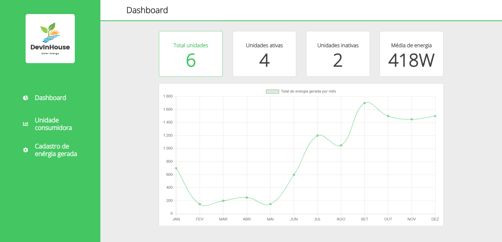
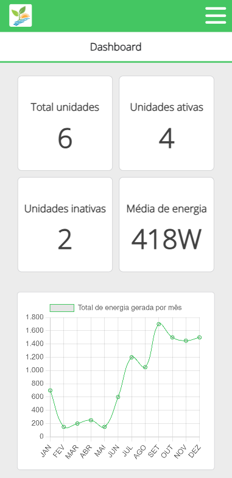

# DevInHouse Solar Energy

## Descrição

<p>Este projeto é uma aplicação web desenvolvida em React e typescript que permite o gerenciamento de unidades consumidoras e suas respectivas gerações de energia mensais.</p>

### desktop

<div>
 
</div>

### mobile

<div>
 
</div>

## Bibliotecas Utilizadas

<p>As seguintes bibliotecas foram utilizadas neste projeto:</p>

 - React: biblioteca para construção de interfaces de usuário.
 - React Router Dom: biblioteca para criação de rotas entre as diferentes telas da aplicação.
 - Chart.js: biblioteca para criação de gráficos.
 - Axios: biblioteca para realização de requisições HTTP.
 - Material UI: biblioteca para criação de componentes.
 - Styled Components: biblioteca de estilização CSS in JS.
 - React Loading Skeleton: biblioteca de carregamentos de elementos.
 - Yup: biblioteca de validação de formulário.
 - Jest: framework de teste em javascript.
 - Testing Library: biblioteca de testes.

## Funcionalidades
<p>A aplicação contém as seguintes funcionalidades:<p>

 - Tela de Login: Contém um formulário de email e senha obrigatórios. Ao clicar no botão de entrar e passar pela validação, o usuário é redirecionado para a tela de Dashboard.
 - Menu Lateral: Contém as opções Dashboard, Unidade Consumidora e Cadastro de Energia Gerada. O menu foi configurado utilizando a biblioteca react-router-dom.
 - Tela de Dashboard: Contém 4 cards que exibem informações sobre as unidades consumidoras cadastradas, além de um gráfico de linha que exibe o total de energia gerado por mês.
 - Tela de Listagem de Unidades: Exibe uma tabela com as unidades consumidoras cadastradas e botões para editar e remover cada uma. Também contém um botão para adicionar uma nova unidade consumidora.
 - Tela de Cadastro de Unidades: Permite cadastrar uma nova unidade consumidora, contendo um formulário com campos obrigatórios.
 - Botão Remover Unidade: Permite remover uma unidade consumidora existente.
 - Botão Editar Unidade: Permite editar uma unidade consumidora existente.
 - Tela de Lançamento de Geração Mensal: Permite cadastrar uma nova geração mensal de energia para uma unidade consumidora existente.

## Requisitos

<p>Para executar o projeto, é necessário ter instalado o Node.js e o gerenciador de pacotes npm ou yarn. Além disso, é necessário instalar as dependências do projeto, utilizando o seguinte comando:</p>


```cmd
npm install
```
Para iniciar a aplicação, basta executar o seguinte comando:

```cmd
npm start
```
